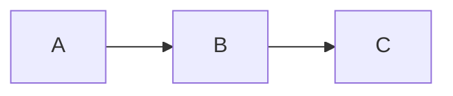

# Deckset Feature Spec

This document specifies Deckset-compatible features to be added to `lib/build.rb` and the HTML templates. Each section describes the intended behaviour, the Markdown syntax, and how the feature should be rendered into HTML.

---

## Core Markdown / Text

### Strikethrough

**Syntax:** `~~text~~`

Renders as `<del>text</del>`. Processed as an inline pattern alongside bold and italic.

### Superscript and Subscript

**Syntax:** Raw HTML passthrough — `<sup>text</sup>` and `<sub>text</sub>`.

The renderer currently HTML-escapes all input, which would destroy these tags. The fix is to allow a small whitelist of inline HTML elements (`<sup>`, `<sub>`) to pass through unescaped. Everything else continues to be escaped.

### H4–H6 Headings

**Syntax:** `####`, `#####`, `######`

The `HEADINGS` constant and `render_heading` function currently only handle H1–H3. Extend the map to include H4, H5, and H6. These headings will rarely appear in practice but the renderer should not drop them.

### Block Quotes

**Syntax:**
```
> This is a quoted passage.
> It can span multiple lines.
```

Each line prefixed with `> ` belongs to the same block quote block. Renders as `<blockquote><p>...</p></blockquote>`. Consecutive `>`-prefixed lines are joined into one blockquote. Inline formatting applies inside the quoted text.

### Quote Attribution

**Syntax:**
```
> To iterate is human, to recurse divine.
-- L. Peter Deutsch
```

A line starting with `--` (optionally followed by `—`) that immediately follows a block quote is the attribution. Renders as a `<cite>` element inside the `<blockquote>`:

```html
<blockquote>
  <p>To iterate is human, to recurse divine.</p>
  <cite>L. Peter Deutsch</cite>
</blockquote>
```

### Footnotes and Citations

**Syntax:**

Inline reference: `Text[^1]` or `Text[^Author, 1995]`
Definition (anywhere in the slide file): `[^1]: Footnote content here.`

Footnote references are collected during parsing. References render as superscript numbers linking to the definition. Definitions are collected and can be rendered in a footnote area at the bottom of the slide, or suppressed and shown only in reading mode. Inline formatting applies inside definition text.

This is a complex feature — a simple first implementation can render definitions as small text at the bottom of whichever slide the definition appears on.

### Tables

**Syntax:**
```
| Column A | Column B | Column C |
| -------- |:--------:| --------:|
| left     | center   | right    |
| cell     | cell     | cell     |
```

- Column separator: `|`
- Header/body separator row: at least three hyphens per cell
- Alignment: `---` = left (default), `:---:` = center, `---:` = right

Renders as a standard HTML `<table>` with `<thead>` and `<tbody>`. The block detector should identify a table when a line contains `|` and the following line matches the separator pattern. Inline formatting applies inside cells.

---

## Images

### Full-Slide Background Image

**Syntax:** `` — an image tag with no modifiers and no `inline` keyword.

When an image tag appears alone on a slide (the only non-empty line, or the only content block), it becomes the slide background. Rendered by setting the slide element's `background-image` CSS property and adding a `slide--bg-image` class. The image is sized with `background-size: cover` and `background-position: center`.

```html
<div class="slide slide--bg-image" style="background-image: url('image.jpg')">
  <div class="slide-content"><!-- any other content --></div>
</div>
```

### Left/Right Image Split

**Syntax:** `` or ``

Divides the slide into two halves. The image occupies the left or right 50%, and any remaining slide content (headings, text, lists) fills the other half. Rendered as a flex container:

```html
<div class="slide-content slide-content--split-left">
  <div class="slide-image-pane">
    
  </div>
  <div class="slide-text-pane">
    <!-- other slide content -->
  </div>
</div>
```

The image pane uses `object-fit: cover` to fill its half. `split-left` puts the image on the left; `split-right` puts it on the right with the text pane first in DOM order but laid out on the left via flex.

### Inline Images

**Syntax:** `` or ``

Renders as a standard `` tag within the content flow, centered by default. The optional percentage sets `max-width`. Multiple inline images on consecutive lines (or the same paragraph block) are placed side by side in a flex row.

```html
<div class="inline-images">
  
  
</div>
```

### Video Embedding

**Syntax:** `` or ``

Local video files (`.mp4`, `.mov`, `.webm`) render as an HTML `<video>` element. YouTube URLs render as an `<iframe>` embed. Both fill the slide by default (like a background image) unless `inline` is specified.

**Modifiers (space-separated in the alt text):**
- `autoplay` — adds the `autoplay` attribute (muted is required for autoplay in browsers)
- `loop` — adds the `loop` attribute
- `mute` / `muted` — adds the `muted` attribute
- `inline` — renders in content flow rather than as background

```html
<!-- Local video, full slide -->
<video class="slide-video" src="demo.mp4" autoplay muted loop playsinline></video>

<!-- YouTube embed -->
<iframe class="slide-video" src="https://www.youtube.com/embed/ID?autoplay=1&mute=1" allowfullscreen></iframe>
```

Detection: if the image `src` ends with a video extension or matches a YouTube URL pattern, treat it as video rather than image.

---

## Code Blocks

### Fenced Code Blocks with Syntax Highlighting

**Syntax:**
````
```ruby
def hello
  puts "world"
end
```
````

Fenced blocks are delimited by triple backticks (or tildes). An optional language identifier follows the opening fence. The renderer should collect lines between the fences as a verbatim block, HTML-escape the content, and wrap it in `<pre><code class="language-ruby">`.

Syntax highlighting is applied client-side using **highlight.js** (loaded in the HTML template). highlight.js automatically detects the language class and colorizes the block on page load. A minimal highlight.js build should be bundled or loaded from CDN.

```html
<pre><code class="language-ruby">def hello
  puts "world"
end</code></pre>
```

The block parser must handle fenced blocks before attempting paragraph rendering — lines inside fences must not be processed as headings or lists.

### Line Numbers

**Syntax:** `[.line-numbers: true]` on the line before the fenced block.

Adds a line number gutter to the left of the code block. Implemented with CSS counters on `.code-line` spans, or by prepending a `<span class="line-number">` inside each line span.

---

## Diagrams

### Mermaid

**Syntax:**
````

````

Mermaid diagrams are rendered client-side. The renderer emits the diagram source inside a `<div class="mermaid">` element (the standard Mermaid.js convention). The HTML template loads the Mermaid.js library, which finds all `.mermaid` divs and renders them into SVGs on page load.

```html
<div class="mermaid">
graph LR
  A --> B --> C
</div>
```

The diagram source must not be HTML-escaped beyond what Mermaid.js requires. Mermaid handles its own parsing.
