autoscale: true
fit-header: #, ##


---

[.column]

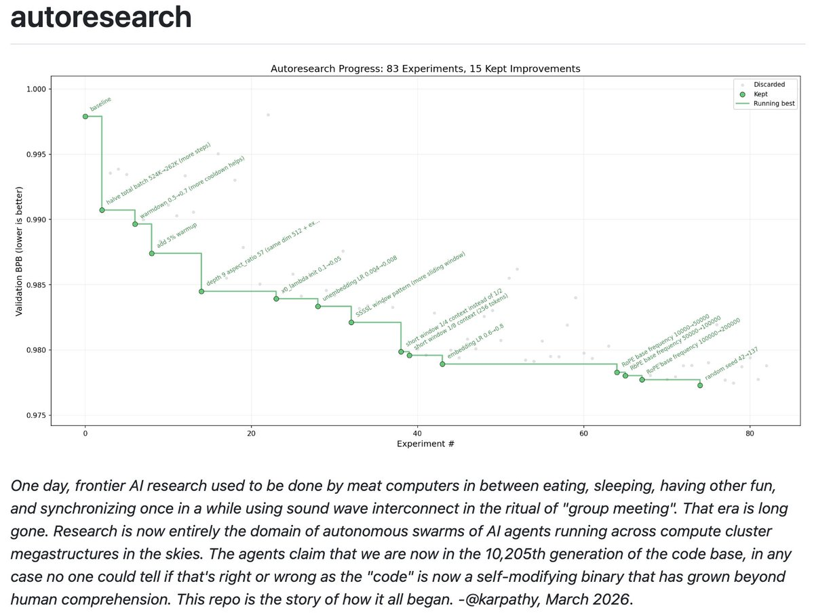

[.column]

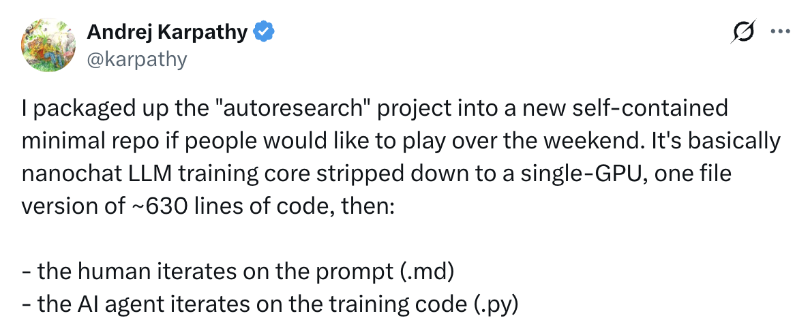

March 8th, 2026

---

[.column]


> "In 30 minutes, it produced something that would have normally been a seven-year PhD thesis"
-- David Friedberg, All-In Podcast

[.column]


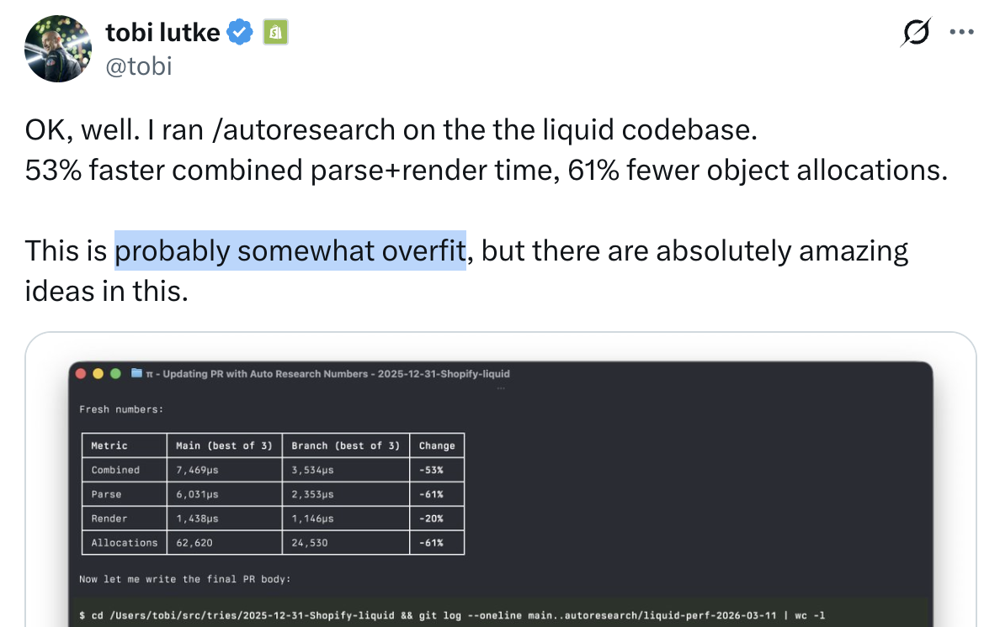

March 13th, 2026

---

# It's gonna take your job!!11

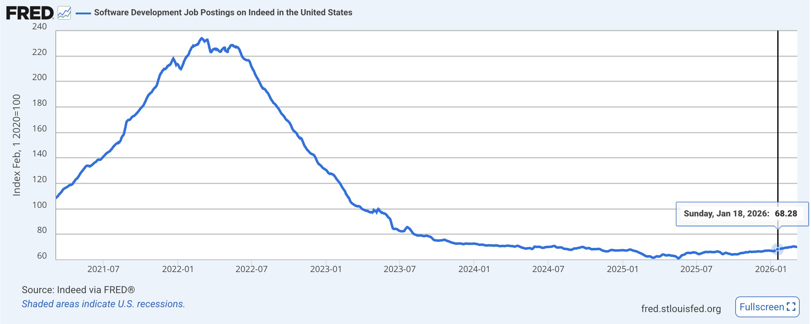

---

>[...] Research is now entirely the domain of autonomous swarms of AI agents running across compute cluster megastructures in the skies. [...] This repo is the story of how it all began.
-- @karpathy, March 2026.

---

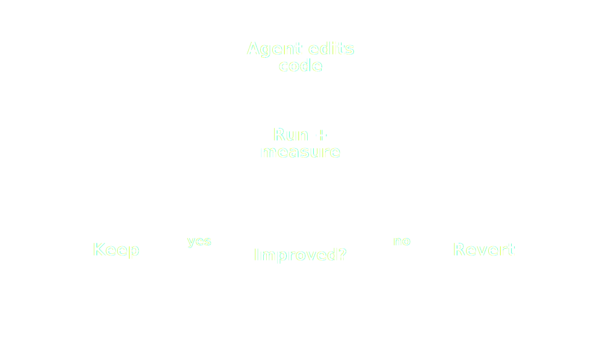


---


---


---

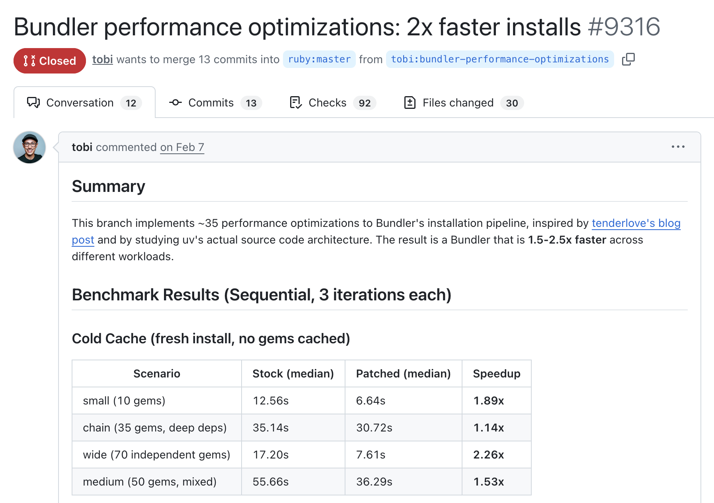

February 7 2026

---

[.column]

## 37 changes
## 8 merged
## 1 original to PR
## all by hand

[.column]

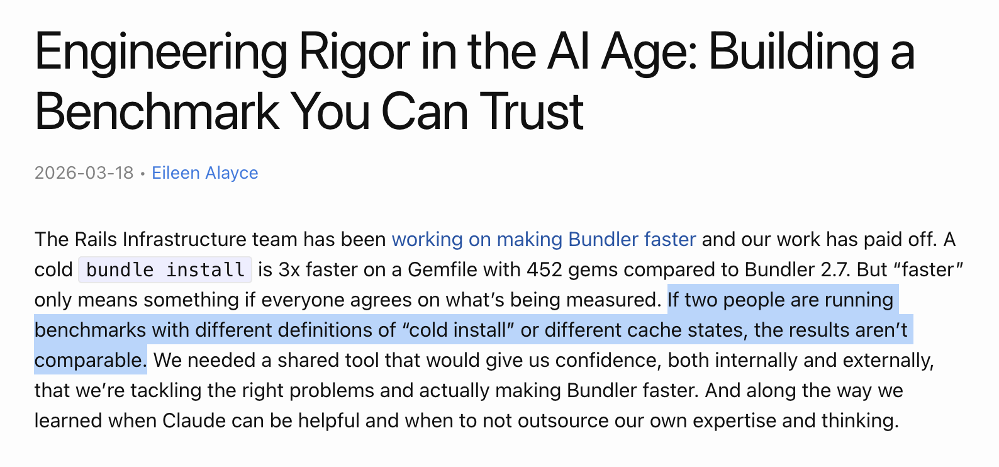

[Post by Eileen Alayce](https://railsatscale.com/2026-03-18-engineering-rigor-in-the-ai-age-building-a-benchmark-you-can-trust/ )

---

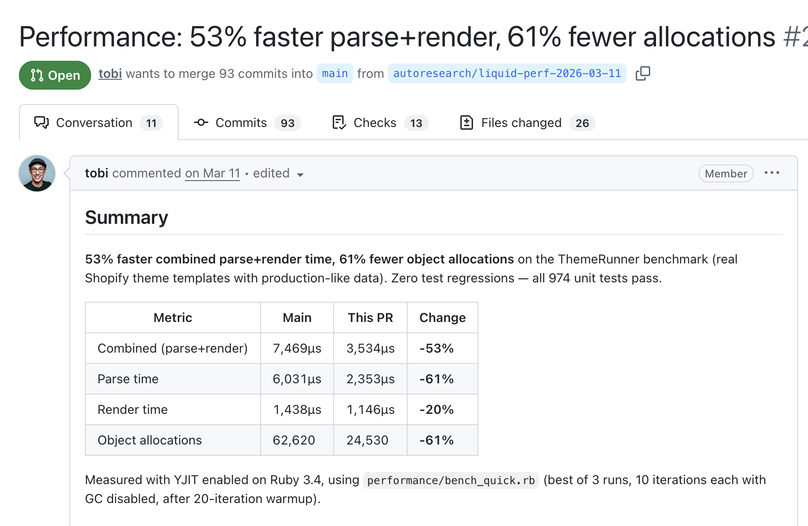

^ Opened 6 weeks ago. Tests do not pass. Nothing merged. No activity

---

> "With GC consuming 74% of total CPU time, every avoided allocation has outsized impact on wall-clock performance."
--@tobi's Claude

---

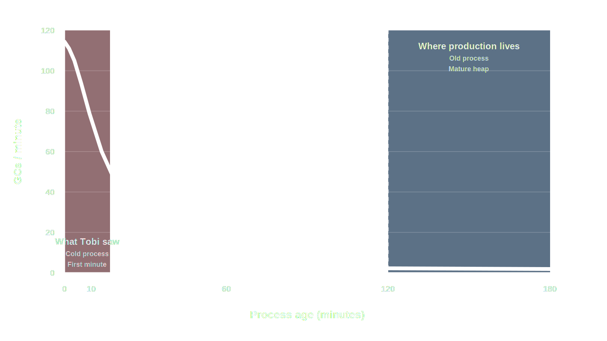

---

# Autoresearch
# doesn't work
# The End

---

#  Stan Lo
# [Reduces ruby-lsp CI time by 33% with 30 lines](https://github.com/Shopify/ruby-lsp/pull/4004)
# [Makes rubydex indexing ~10% faster](https://github.com/Shopify/rubydex/pull/659)
# [Makes another part of rubydex 50% faster](https://github.com/Shopify/rubydex/pull/654)

---

# What if we could
# automatically
# make Ruby
# faster?

---

# **Lesson 1**
# Automatic
# _research_,
# not automatic
# _modification_

---


---

# pi-autoresearch

##  David Cortes, Shopify
## Implementation for the pi agent
## Status-line
## HTML and in-terminal dashboards
## Confidence scoring

---

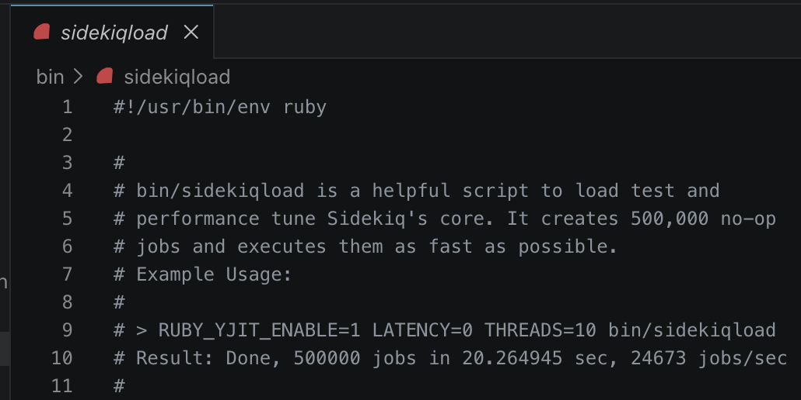

---


---

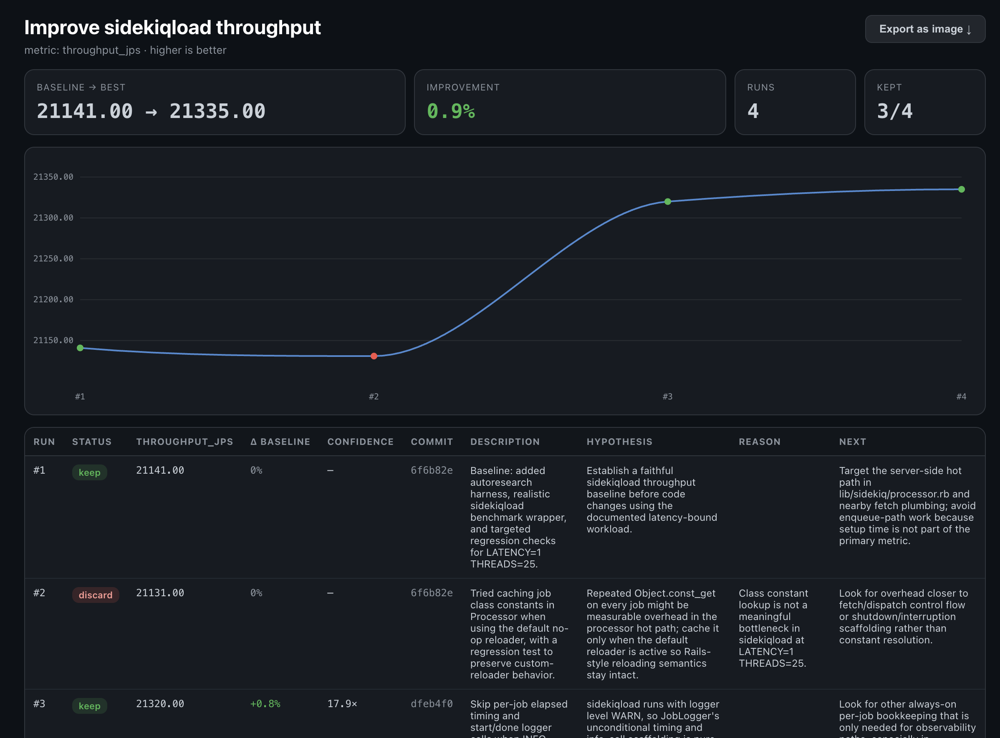

---

# what's Processor::Counter?
# atomic integer
# `PROCESSED = Counter.new`
# incr/decr before Redis flush
# 16 lines of code

---

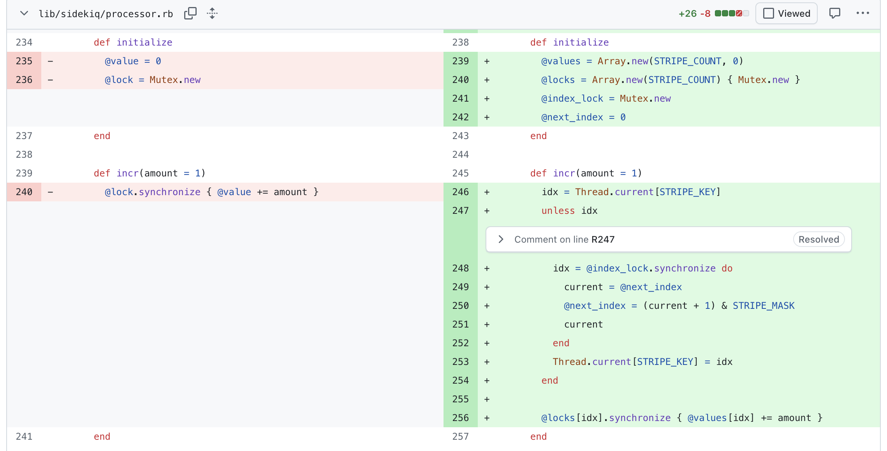

---

# what's a striped lock?
# each thread gets its own state
# writes cheap
# reads expensive

---

# mike would
# literally
# never
# merge this

---

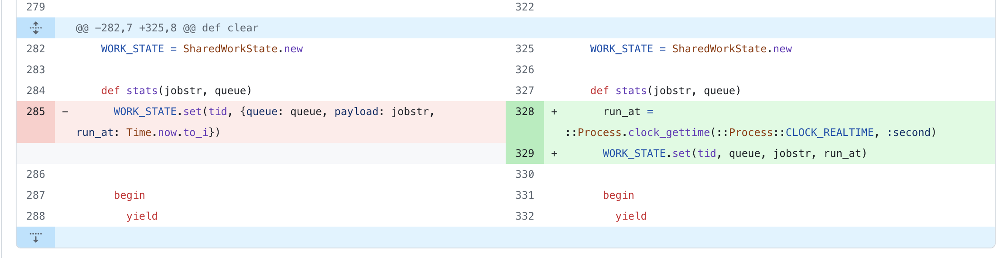

^ This works because we are returning an integer directly rather than allocating a Time object and throwing it away

---

```text
Warming up --------------------------------------
       Time.now.to_i     1.271M i/100ms
Process.clock_gettime    1.708M i/100ms
Calculating -------------------------------------
       Time.now.to_i     12.698M (±0.9%) i/s (78.75 ns/i)
Process.clock_gettime    17.294M (±2.3%) i/s (57.82 ns/i)

Comparison:
Process.clock_gettime: 17294486.8 i/s
       Time.now.to_i: 12698329.6 i/s - 1.36x slower
```

---

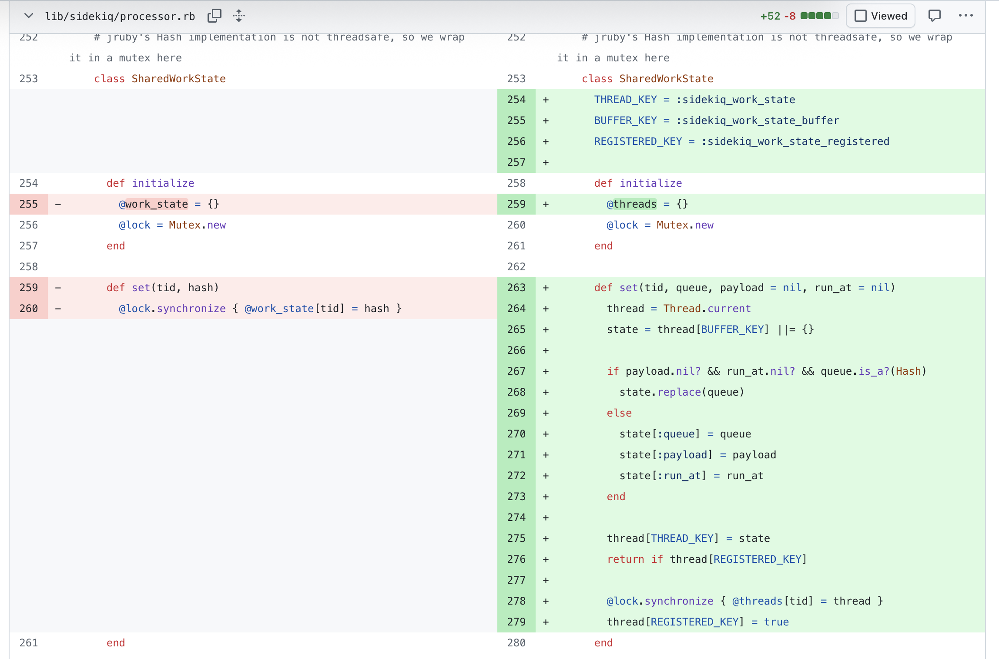

---

# Mike
# would
# never
# merge this

---

# Why generate code
# that you
# can't merge?

---

[.column]

# What do we
# think about
# when we
# merge?

[.column]

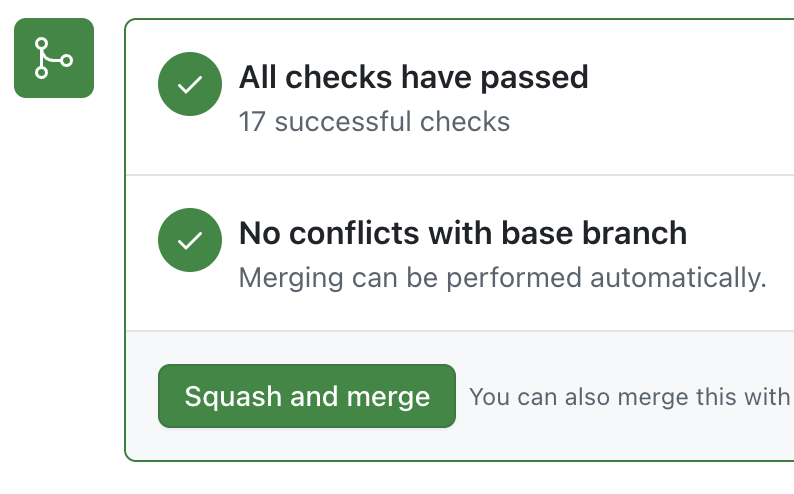

---

# What is
# PR review
# _for_?

^ Have you ever been trained on how to do it? What are you expected to review?

---

# Why might we
# request
# changes?

---

# **"You didn't optimize X"**

```text
-fauto-inc-dec,-fbranch-count-reg,-fcombine-stack-adjustments,-fcompare-elim,-fcprop-registers,-fdce,-fdefer-pop
-fdelayed-branch,-fdse,-fforward-propagate,-fguess-branch-probability,-fif-conversion,-fif-conversion2
-finline-functions-called-once,-fipa-modref,-fipa-profile,-fipa-pure-const,-fipa-reference,-fipa-reference-addressable
-fivopts,-fmerge-constants,-fmove-loop-invariants,-fmove-loop-stores,-fomit-frame-pointer,-freorder-blocks,-fshrink-wrap
-fshrink-wrap-separate,-fsplit-wide-types,-fssa-backprop,-fssa-phiopt,-ftree-bit-ccp,-ftree-ccp,-ftree-ch
-ftree-coalesce-vars,-ftree-copy-prop,-ftree-dce,-ftree-dominator-opts,-ftree-dse,-ftree-forwprop,-ftree-fre
-ftree-phiprop,-ftree-pta,-ftree-scev-cprop,-ftree-sink,-ftree-slsr,-ftree-sra,-ftree-ter,-funit-at-a-time
-falign-functions,-falign-jumps,-falign-labels,-falign-loops,-fcaller-saves,-fcode-hoisting,-fcrossjumping
-fcse-follow-jumps,-fcse-skip-blocks,-fdelete-null-pointer-checks,-fdevirtualize,-fdevirtualize-speculatively
-fexpensive-optimizations,-ffinite-loops,-fgcse,-fgcse-lm,-fhoist-adjacent-loads,-finline-functions
-finline-small-functions,-findirect-inlining,-fipa-bit-cp,-fipa-cp,-fipa-icf,-fipa-ra,-fipa-sra,-fipa-vrp
-fisolate-erroneous-paths-dereference,-flra-remat,-foptimize-sibling-calls,-foptimize-strlen,-fpartial-inlining
-fpeephole2,-freorder-blocks-algorithm=stc,-freorder-blocks-and-partition,-freorder-functions,-frerun-cse-after-loop
-fschedule-insns,-fschedule-insns2,-fsched-interblock,-fsched-spec,-fstore-merging,-fstrict-aliasing,-fthread-jumps
-ftree-builtin-call-dce,-ftree-loop-vectorize,-ftree-pre,-ftree-slp-vectorize,-ftree-switch-conversion,-ftree-tail-merge
-ftree-vrp,-fvect-cost-model=very-cheap,-fgcse-after-reload,-fipa-cp-clone,-floop-interchange,-floop-unroll-and-jam
-fpeel-loops,-fpredictive-commoning,-fsplit-loops,-fsplit-paths,-ftree-loop-distribution,-ftree-partial-pre
-funswitch-loops,-fvect-cost-model=dynamic,-fversion-loops-for-strides
```

---

# **"There is a bug"**
# The bugbots (Cursor, etc) are
# pretty OK
# _at checking for bugs_

^ single axis

---

# **"There is a tradeoff"**
# Is a level of
# performance
# that is Good Enough?

---

# CPU: 50 microsec per job
# IO: 1000 microsec per job
# Possible improvement: ~5%

---

# **"This is too complicated"**
# Flog/flay loops,
# ABC scores,
# LOC count

---

# **"This is too risky"**
# The hardest problem
# in computer science is
# cache invalidation

^ Autoresearch LOVES caches. Is it even valid? It's certainly buggy!

---

# **"This passes tests, but..."**
# Autoresearch
# assumes you
# have good tests

---

# **"This violates GPL..."**
# Checks not in GitHub:
# legal
# compliance
# Memory use

---

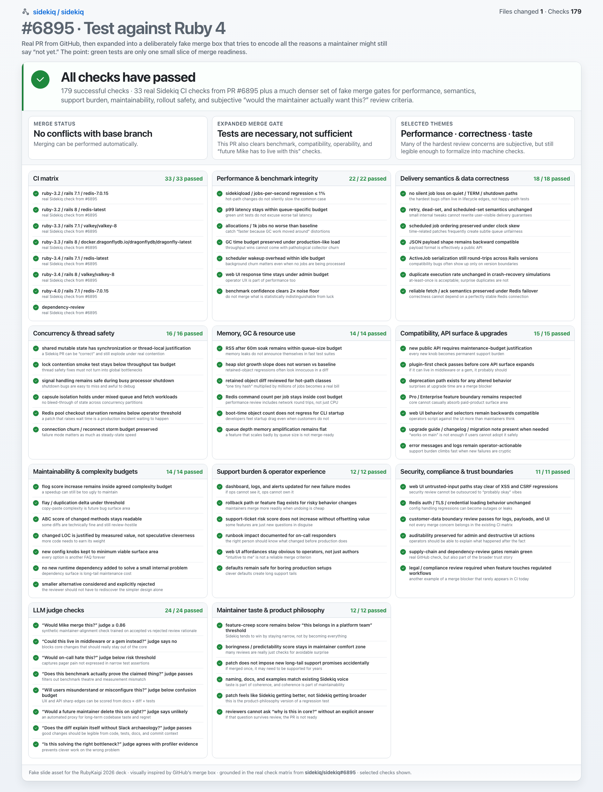

---

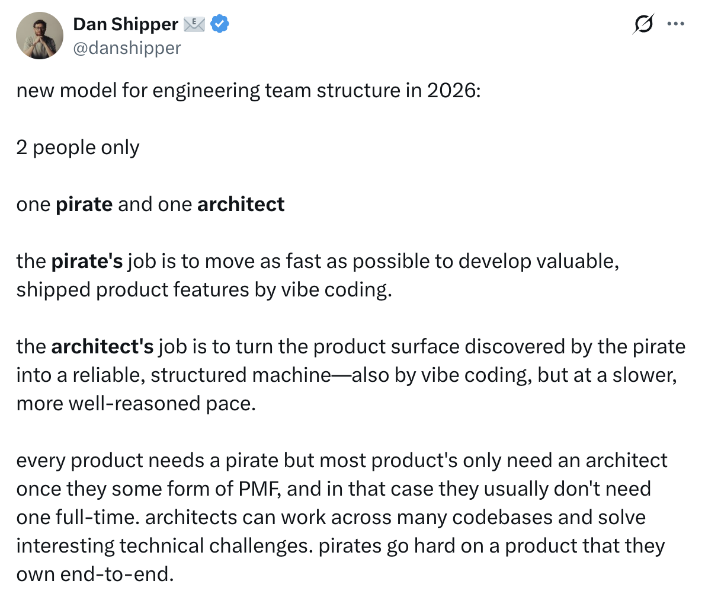

---

# Anyone can now
# generate plausible software,
# the question is
# can you verify it is good?

---

# **Lesson 2**
# Don't autoresearch
# what you don't own
# and cannot Architect
## (accurately review)

---

# Now...
# what if AI
# was the Architect?

---

# AI-software-dev today is
# baby-sitting


---

# 1-4 windows open
# Scroll while it runs
# Steer, write messages

---

# "Just use
# this skill"

^ No evals, no backpressure, just vibes

---

# Unlimited generation +
# review bottleneck
# = slop

> When an AI Agent can produce a working implementation in minutes, waiting hours or days for a human to review it is an impedance mismatch.
--Kesha, Intercom

---


---

> The bitter lesson is based on the historical observations that
> 1) AI researchers have often tried to build knowledge into their agents,
> 2) this always helps in the short term, and is personally satisfying to the researcher, but
> 3) in the long run it plateaus and even inhibits further progress, and
> 4) breakthrough progress eventually arrives by an opposing approach based on scaling computation by search and learning.
-- Richard Sutton

---

> The bitter lesson is based on the historical observations that
> 1) AI researchers have often tried to build knowledge into their agents,
> 2) this always helps in the short term, and is personally satisfying to the researcher, but
> 3) in the long run it plateaus and even inhibits further progress, and
> 4) _breakthrough progress eventually arrives by an opposing approach based on scaling computation by search and learning._
-- Richard Sutton

---

# **Lesson 3**
# Loops apply the bitter lesson
# They scale compute
# Through allowing search
# and "brute force"

---

# "Babysitting" is looping
# With a human gate

---

# "Agents" are just a loop

```ruby
messages = [user_prompt]

loop do
  reply = llm.call(messages, tools: TOOLS)

  break puts(reply.text) unless reply.tool_call?

  result = run_tool(reply.tool_name, reply.arguments)
  messages << reply
  messages << tool_result(result)
end
```

^ Agents took the "chat" agent model and allowed the LLM to autonomously loop around tool use without waiting on user input.

---

# Ralph loop

```bash
while :; do
  cat PROMPT.md | claude-code

  ./build_and_test || continue

  git add -A
  git commit -m "ralph: passing build"
  git push
  git tag "$(next_patch_tag)"
done
```

^ Huntley's original Ralph is, in its purest form, just `while :; do cat PROMPT.md | claude-code ; done`. In practice the prompt pins the stack (plan/specs), and the outer shell only commits/tags once build or test gates are green.

---

# Autoresearch

```ruby
best = benchmark

loop do
  change = agent.propose_optimization
  apply(change)

  score = benchmark

  if score > best
    git_commit(change.summary)
    best = score
  else
    git_revert
  end
end
```

^ Autoresearch is a loop where improvements are kept as we go through the loop, but the pass/fail gate is actually a single continuous variable rather than a discrete true/false value

---

# In a loop,
# skills and "memory"
# are extras, but
# not required

---

# Putting gates into
# software makes
# decisions explicit
# reduces variation

---

# Most of my consulting
# is forcing teams to
# define:
# "What does _slow_ mean?"

---

## nateberkopec/puma-release

1. Make sure you're on the right Puma branch, clean, synced, and green.
2. Look at everything since the last release.
3. Decide what kind of release this should be.
4. Generate release notes with AI.
5. Pick or request a codename if needed.
6. Update version files and release docs, SECURITY.md.
7. Create a release branch and open a release PR.
8. Wait for that PR to be reviewed and merged.
9. Once merged, create and push the signed final tag.
10. Build both the MRI and JRuby gems.
11. Push those gems to RubyGems.
12. Wait until RubyGems actually reflects the new release.
13. Create or repair the GitHub release draft.
14. Upload both gem files to the GitHub release.
15. Publish the GitHub release.
16. Stop when the release is fully visible and complete.

---

[.column]

# Factory loop[^1]

```ruby
backlog.each do |spec| # this is the factory
  loop do # This part is kind of ralph-y
    code = agent.implement(spec)

    gates = scenarios.map do |s|
      s.run(code)
    end

    break if gates.all?(&:pass?)
  end

  ship(code)
end
```

[^1]: [strongdm.com/blog/the-strongdm-software-factory](https://www.strongdm.com/blog/the-strongdm-software-factory-building-software-with-ai), [factory.strongdm.ai/techniques](https://factory.strongdm.ai/techniques), [simonwillison.net/2026/Feb/7/software-factory](https://simonwillison.net/2026/Feb/7/software-factory/)

^ StrongDM's factory: Attractor writes code from a spec, scenarios run against Digital Twins of dependencies, and many gates must all pass. Multivariate — not one score, but a fleet of independent checks.

---

# Curate context, prompt
# Provide tools (MCP, CLI)
# Loop until gates passed
# Loop until no more backlog

---

# **Curate context/prompt**


---

# **Provide tools**
# Production access
# explain analyze on prod
# prod console1984 (Intercom)
# MCP proxies

---

# In the factory,
# the software is **mush**,
# the **gates** are the artifact

---

# Even if we fail,
# we'll be building
# better software
# with better gates

---

> Code must not be written by humans
> Code must not be reviewed by humans
-- StrongDM's "Software Factory"[^2]

[^2]: [simonwillison.net/2026/Feb/7/software-factory](https://simonwillison.net/2026/Feb/7/software-factory/)

---

# In the dark factory,
# you will not
# be allowed inside

---

# Attractor / Fabro
### "A non-interactive coding agent"

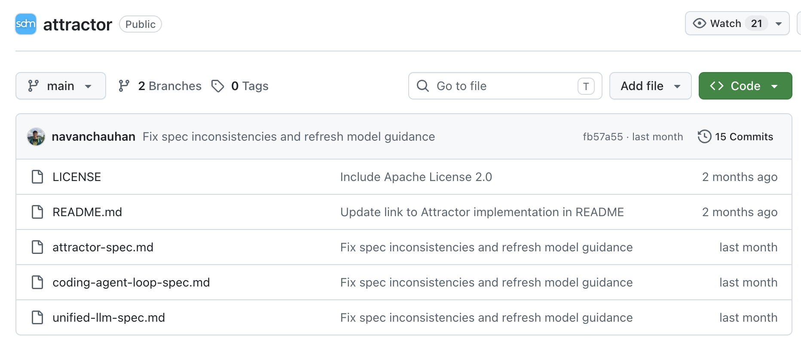 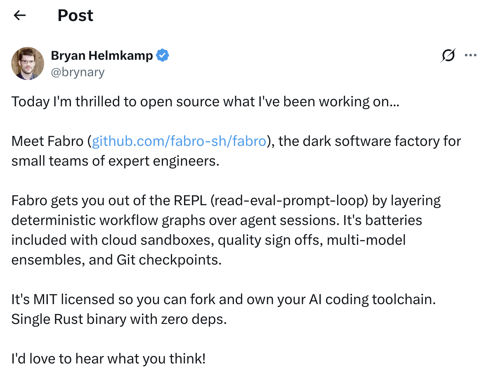

---

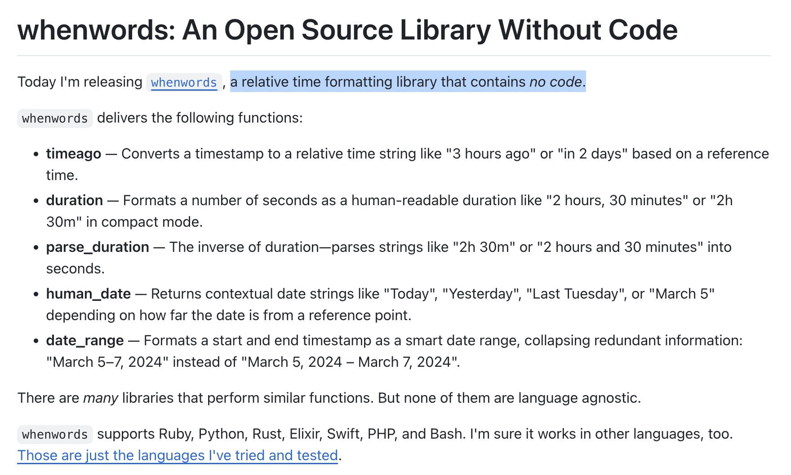

---


---

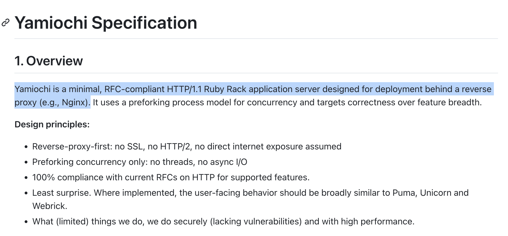


---


---

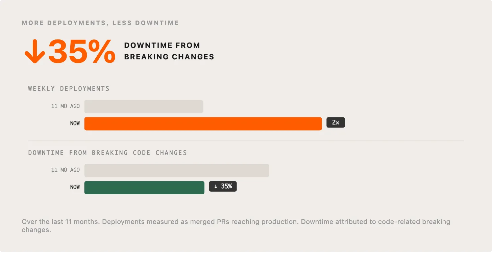


---

# Risks:
## No one knows
## what they're doing

---

# Is merge-time
# the only time?

> the decision of which code path to enter - which version of a module to run - happens at runtime, not at deploy time.
-- Tomash, WRUG[^3]

^ What about in production at runtime via flippers?

[^3]: https://tomash.wrug.eu/blog/2026/04/19/new-modularity/)

---

# Formal methods? Property-based testing?

> "Reasonable-looking algorithms can easily be incorrect. Algorithm correctness is a property that must be carefully demonstrated." - Steven Skiena via Leo Domura[^4]

^ How? Property-based testing or formal verification?

[^4]: https://leodemoura.github.io/blog/2026-2-28-when-ai-writes-the-worlds-software-who-verifies-it/

---

# Formal verification

```
def parseBody (contentLength : Nat) (buf : List UInt8) :
    List UInt8 × List UInt8 :=
  (buf.take contentLength, buf.drop contentLength)

example (n : Nat) (buf : List UInt8) (h : n ≤ buf.length) :
    (parseBody n buf).1.length = n := by
  simp [parseBody, List.length_take, h, Nat.min_eq_left]

example (n : Nat) (buf : List UInt8) :
    (parseBody n buf).1 ++ (parseBody n buf).2 = buf := by
  simpa [parseBody] using List.take_append_drop n buf
```

^ After headers are parsed, `Content-Length` tells us how many bytes belong to the body. This model proves two useful things. First, if we have at least `n` bytes buffered, the body we hand upstream has length exactly `n`. Second, body bytes plus leftover bytes reconstruct the original buffer, so we didn't drop or invent data.

---

# Property-based testing

```ruby
1000.times do
  body = SecureRandom.bytes(rand(0..256))
  req  = "POST / HTTP/1.1\r\nContent-Length: #{body.bytesize}\r\n\r\n#{body}"

  parsed = parse_http(req)
  raise unless parsed.content_length == body.bytesize
  raise unless parsed.body == body
end
```

^ Instead of proving the parser correct, we generate lots of random valid requests and check an invariant: the parser must return the same `Content-Length` and body we put in. This is property-based testing: define a property, then hammer it with many inputs. Much cheaper than formal proof, and very good at finding edge cases humans would never think to write by hand.

---

# Scalable?

> "There are two ways of constructing a software design: one way is to make it so simple that there are obviously no deficiencies, and the other is to make it so complicated that there are no obvious deficiencies." Tony Hoare, 1980 Turing Award Lecture via Peter Levine[^5]

[^5]: https://peterlavigne.com/writing/human-code-review-over-full-verification

---

# Applicable to brownfield?


^ It is extremely difficult to observe the behavior of an existing program in 100%/all aspects, it represents 25+ years of profiling and hard won changes which were never written down in a spec

---

# How do you prevent
# runaway LOC?
## LLMs tend to "over-shoot"

>Mutation testing is typically used to expand your test suite. However, if we assume our tests are correct, we can instead use it to restrict the code. This constrains the solution space to ensure that only the requirements are met.
-- Peter Levine

---

# Where are we gonna run
# all this compute?

> The only common denominator? We're all using VMs to isolate, try, share, iterate, parallelize. So many VMs.
-- Philip Zeyliger, "Everyone is Building a Software Factory"[^6]

* code-on-incus?
* miren?
* gondolin?

[^6]: https://blog.exe.dev/bones-of-the-software-factory

---

# How much will be deterministic,
# and how much will be an LLM judge?
## _Who watches the watchmen?_

---

# Does byroot emerge
# from the training data?

```
compare-ruby: ruby 4.1.0dev (2026-01-17T14:40:03Z master 00a3b71eaf) +PRISM [arm64-darwin25]
built-ruby: ruby 4.1.0dev (2026-01-18T12:55:15Z spedup-file-join 5948e92e03) +PRISM [arm64-darwin25]
warming up....

|              |compare-ruby|built-ruby|
|:-------------|-----------:|---------:|
|two_strings   |      2.477M|   19.317M|
|              |           -|     7.80x|
|many_strings  |    547.577k|   10.298M|
|              |           -|    18.81x|
|array         |    515.280k|  523.291k|
|              |           -|     1.02x|
|mixed         |    621.840k|  635.422k|
|              |           -|     1.02x|
```

https://byroot.github.io/ruby/performance/2026/04/18/faster-paths.html

---

# Runtime feature flags?
# What can be specified?
# Toy projects only?
# Is it too hard?
# Greenfield only?
# Is it copyrightable?
# Is LOC too high?
# Where will it run?
# Determinstic vs LLM gates
# Is byroot in the training data?

---

# Takeaways

---

# Best for low-attention code
# with a high-skill reviewer
# (Be Like Stan)

---

# Apply against small,
# mature scopes, not
# big rescues

---

# Research without verification
# is waste.
# PRs created and not merged
# are waste.

---

# Start where
# you need
# the fewest
# gates

---

[.column: width(2)]
# Gate/eval
# design
[.column: width(1)]
# >
[.column: width(2)]
# code or
# skill design

---

# Try a loop:
# ralph (discrete)
# autoresearch (continuous)
# factory (multi-gate)

---

# try
# pi and
# pi-autoresearch
## github.com/davebcn87/pi-autoresearch
---

# Thank you.
# @nateberkopec
# speedshop.co
## github.com/nateberkopec/rubykaigi-2026
